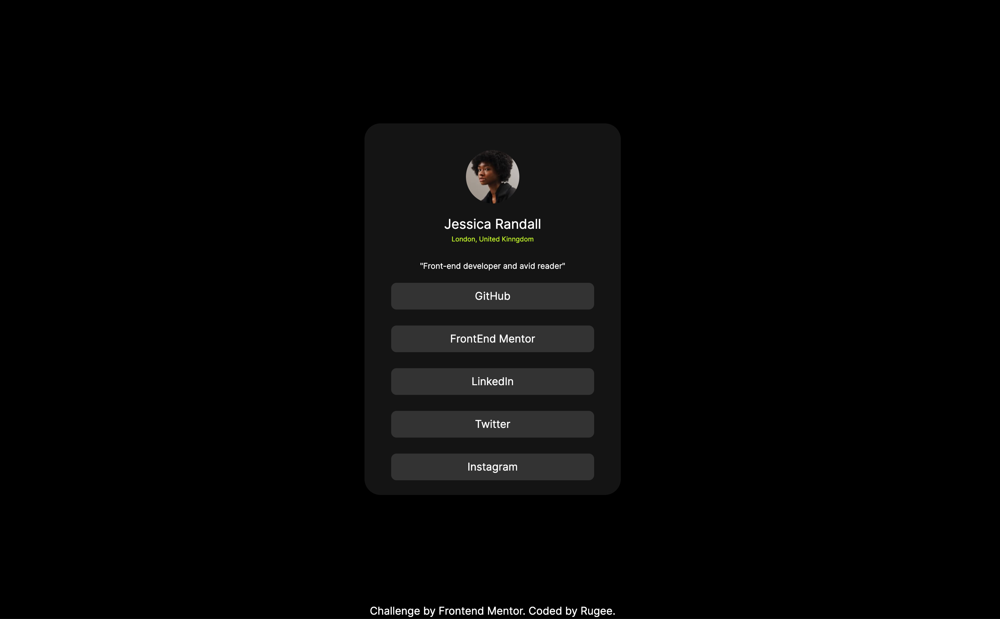

# Frontend Mentor - Social links profile solution

This is a solution to the [Social links profile challenge on Frontend Mentor](https://www.frontendmentor.io/challenges/social-links-profile-UG32l9m6dQ). Frontend Mentor challenges help you improve your coding skills by building realistic projects. 
## Table of Contents

- [Overview](#overview)
  - [The Challenge](#the-challenge)
  - [Screenshot](#screenshot)
  - [Links](#links)
- [My Process](#my-process)
  - [Built With](#built-with)
  - [What I Learned](#what-i-learned)
  - [Continued Development](#continued-development)
  - [Useful Resources](#useful-resources)
- [Author](#author)

---

## Overview

### The Challenge

Users should be able to:

- View the optimal layout for the component depending on their device's screen size.

### Screenshot

Add a screenshot of your solution here. Use tools like Snipping Tool, Lightshot, or any screen capture tool to capture the screenshot and save it to the repository.



---

### Links

- Solution URL: [GitHub Repository](https://github.com/RugeeFan/social-links-profile)
- Live Site URL: [Live Site](https://social-links-profile-main-sable-sigma.vercel.app/)

---

## My Process

### Built With

- Semantic HTML5 markup
- Tailwind CSS
- Flexbox
- [Vite](https://vitejs.dev/) - Frontend tooling
- React.js

---

### What I Learned

This project helped me practice:
- Using Tailwind CSS for utility-first styling.
- Building component-based layouts with React.
- Creating responsive designs for both desktop and mobile devices.

Here is an example of the key code structure:

```jsx
<div className="bg-slate-300 h-screen flex justify-center items-center">
  <div className="bg-white p-6 rounded-lg shadow-md text-center">
    
    <h1 className="text-slate-900 text-xl font-bold mb-2">
      Improve your front-end skills by building projects
    </h1>
    <p className="text-slate-500 text-sm">
      Scan the QR code to visit Frontend Mentor and take your coding skills
      to the next level.
    </p>
  </div>
</div>
